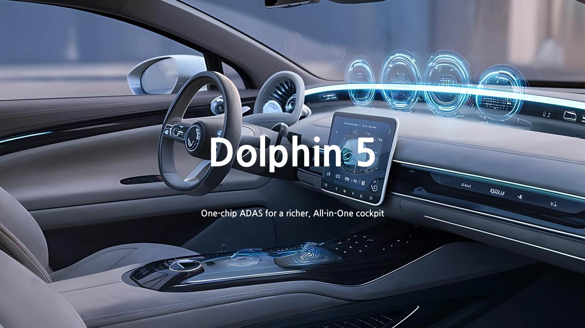

# **TCC807x (Dolphin 5) Model Zoo**

This repository provides a collection of neural network models optimized for Telechips Cockpit (TCC807x).

The models are ready to run on evaluation boards and include benchmark results that show how the TCC807x performs.

---

## **1. Chip Description**
The TCC807x features an integrated Neural Processing Unit (NPU).
With support for up to 8 TOPS, the TCC807x redefines in-car innovation with scalable, integrated solutions tailored for both infotainment and advanced driver assistance systems (ADAS).

### TCC807x (D5)
- **Performance:** 8 TOPS  
- **Target Applications:**  
  - Advanced driver assistance systems (ADAS)
  - Vision-based applications (multi-camera processing)  
  - Driver Monitoring System (DMS)  
  - Deep learning inference

With an integrated NPU, the TCC807x delivers real-time neural network inference with high efficiency and scalable performance for automotive applications.

---

## **2. Overview of Model Zoo**
The following table summarizes the image classification and object detection models supported on TCC807x.
Each model name links to its dedicated page with performance metrics and deployment instructions.  

**Note:** The models covered in this document are based on original network architectures or have been minimally modified for compatibility with TCC807x execution. The results shown are not guaranteed for production use, and you are responsible for any further optimization.

### [Classification](Classification/README.md)

<table border="1" cellspacing="0" cellpadding="5" style="width:100%; table-layout:fixed;">
    <thead>
        <tr>
            <th rowspan="2" colspan="2">Model</th>
            <th rowspan="2">Input Size (WxHxC)</th>
            <th rowspan="2">Inference Time (ms)</th>
            <th rowspan="2">Accuracy</th>
        </tr>
    </thead>
    <tbody>
        <tr>
            <td align="center" colspan="2">EfficientNet-Lite0</td> <!-- Model -->
            <td align="center">224x224x3</td> <!-- Input Size (WxHxC) -->
            <td align="center">1.49</td> <!-- Inference Time (msec): EVB -->
            <td align="center">0.725</td> <!-- Accuracy -->
        </tr>
        <tr>
            <td align="center" colspan="2">MobileNet-v2-1.4</td> <!-- Model -->
            <td align="center">224x224x3</td> <!-- Input Size (WxHxC) -->
            <td align="center">1.16</td> <!-- Inference Time (msec): EVB -->
            <td align="center">0.712</td> <!-- Accuracy -->
        </tr>
    </tbody>
<table>

### [Object Detection](Object_Detection/README.md)

<table border="1" cellspacing="0" cellpadding="5" style="width:100%; table-layout:fixed;">
    <thead>
        <tr>
            <th rowspan="2" colspan="2">Model</th>
            <th rowspan="2">Input Size (WxHxC)</th>
            <th rowspan="2">Inference Time (ms)</th>
            <th rowspan="2">mAP@50</th>
        </tr>
    </thead> 
    <tbody>
        <tr>
            <td align="center" colspan="2">SSDlite-MobileNet-v1</td> <!-- Model -->
            <td align="center">300x300x3</td> <!-- Input Size (WxHxC) -->
            <td align="center">16.58</td> <!-- Inference Time (msec): EVB -->
            <td align="center">0.341</td>
        </tr>
        <tr>
            <td align="center" colspan="2">YOLOv3</td> <!-- Model -->
            <td align="center">416x416x3</td> <!-- Input Size (WxHxC) -->
            <td align="center">15.21</td> <!-- Inference Time (msec): EVB -->
            <td align="center">0.560</td>
        </tr>
        <tr>
            <td align="center" colspan="2">YOLOv3-tiny</td> <!-- Model -->
            <td align="center">416x416x3</td> <!-- Input Size (WxHxC) -->
            <td align="center">2.50</td> <!-- Inference Time (msec): EVB -->
            <td align="center">0.319</td>
        </tr>
    </tbody>
<table>

---

## **3. Getting Started**
Follow these steps to run a model provided by Telechips Model Zoo on the TCC807x Evaluation Board (EVB).

### 1. Clone the repository:
<pre> <code>
git clone git@github.com:telechips-ai/TCC807x-Model-Zoo.git
</code> </pre>

### 2. Copy the desired model to the EVB:
Copy the entire model folder (mobileNetV1_SSD) to the TCC807x EVB.  
You can either copy the folder as it is or rename it to mobileNetV1_SSD to match the format used in previously released neural network folders, as shown in the following example.  
Each folder contains the necessary output files (.so, .json, and .param).
<pre> <code>
scp -r [network_output_folder] root@192.168.0.100:/path/to/target/
</code> </pre>
Replace [network_output_folder] with the actual folder (e.g., mobileNetV1_SSD/).  

### ***Example: TCC807x - mobileNetV1_SSD Folder Structure***
<pre> <code>
mobileNetV1_SSD/
├── mod.so        # Compiled model
├── mod.json      # Model graph
└── mod.param     # Binary file of Quantized weight and bias 
</code> </pre>
Then run:
<pre> <code>
scp -r mobileNetV1_SSD/ root@192.168.0.100:/home/root/
</code> </pre>

### 3. Run the model using rtvm:
<pre> <code>
rtvm --model=[network_output_folder_path] --device=cpu --dump-meta --profile --run-count=10
</code> </pre>

---

## 4. **Requirment**

* ethos-n-driver-stack: 25.03
* TVM: 0.18.0
    * Python: 3.10
    * Clang/LLVM: clang+llvm-11.0.0-x86_64-linux-gnu-ubuntu-20.04
    * GCC for Arm: gcc-arm-9.2-2019.12-x86_64-aarch64-none-linux-gnu

---
## 5. **License**
* Model: For each model’s license, please refer to the License block.

* Dataset

| Dataset        | SPDX Identifier  | Full Name                              | Link                                                                     |
| -------------- | ---------------- | -------------------------------------- | ------------------------------------------------------------------------ |
| **COCO2017**   | CC-BY-4.0        | Creative Commons Attribution 4.0 International | [CC BY 4.0](https://creativecommons.org/licenses/by/4.0/)  |
| **ILSVRC2012** | ImageNet Terms of Use | ImageNet Terms of Use                     | [ImageNet](https://www.image-net.org/)                     |
